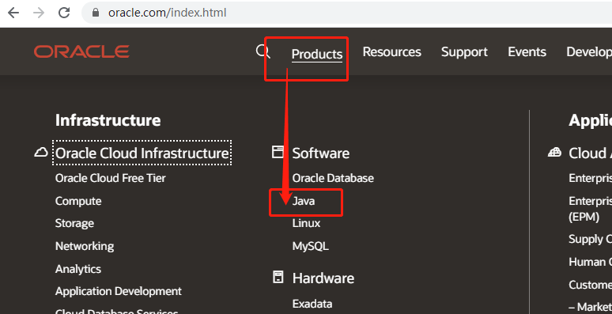
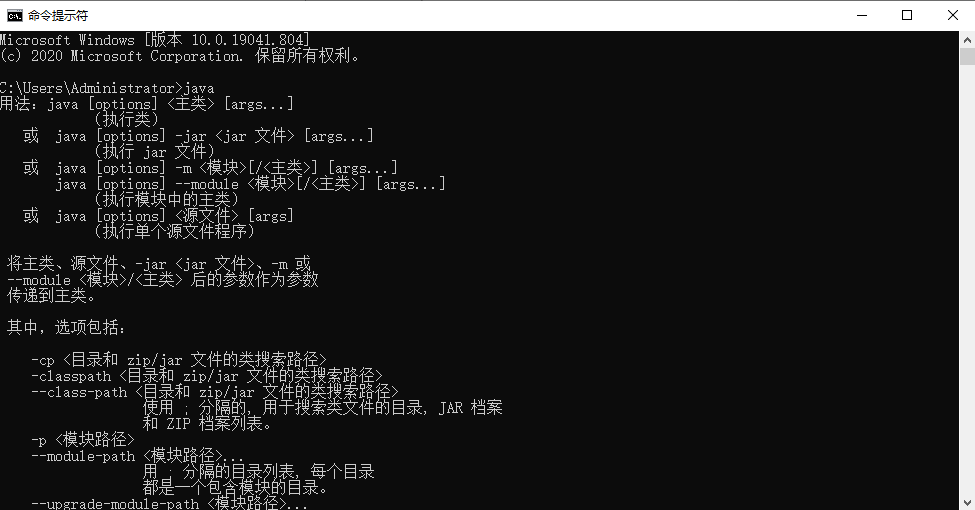

# 1、JDK概述

JDK (Java Development Kit) 是 Java 语言的软件开发工具包。JDK 是整个 JAVA 的核心，包括了 JAVA 运行环境 （Java Runtime Envirnment ）, Java 基础的类库和很多 Java 工具。

它不提供具体的开发软件，它提供的是无论你用任何种开发软件写的 Java 程序都必须用到的类库和 Java 语言规范。


# 2、JDK下载

从 oracle 官网 https://www.oracle.com 中下载，步骤如图所示：




# 3、JDK安装

## 3.1、双击安装

安装，直接 “下一步” 一路安装下去即可。

## 3.2、配置环境变量

我的电脑 --> 属性 --> 高级系统设置 --> 环境变量 --> 系统变量，设置环境变量如下：

- 新建 `JAVA_HOME` ：

  > ```
  > 变量名：JAVA_HOME
  > 变量值：电脑上JDK安装的绝对路径
  > ```

- 新建/修改 `CLASSPATH` 变量：

  > ```
  > 变量名：CLASSPATH
  > 变量值：.;%JAVA_HOME%\lib\dt.jar;%JAVA_HOME%\lib\tools.jar;
  > ```

- 修改Path 变量

  ```
  新建两条路径：
  %JAVA_HOME%\bin
  %JAVA_HOME%\jre\bin
  ```

# 4、检查是否安装成功

检查 打开 cmd，输入 `ava`，出现一连串的指令提示，说明配置成功了:



